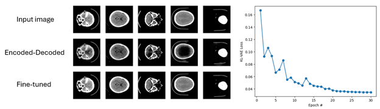
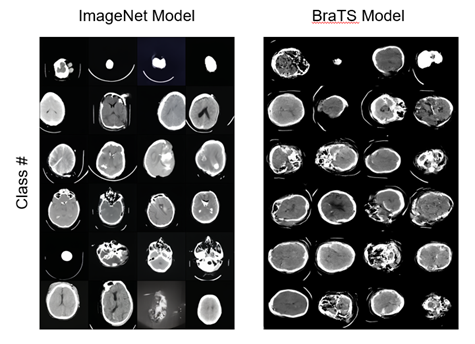
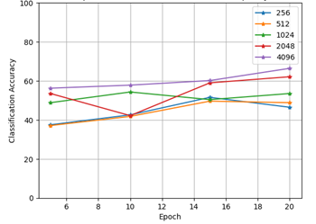

# TransDiffusion

This project was part of a deep learning course and put together over the course of 2 months. We explore transfer learning on medical data using [Diffusion Classifier](https://diffusion-classifier.github.io/). We compare pre-trained conditional latent diffusion models based on their size and amount of data needed to learn the new data distribution. Models are transferred onto the [RSNA-2019 intracranial hemorrhage](https://www.kaggle.com/c/rsna-intracranial-hemorrhage-detection) dataset.

The first model we investigate is the ImageNet model from the [original latent diffusion paper](https://github.com/CompVis/latent-diffusion/tree/main).

The second model is the BraTS MRI model hosted on [MONAI's model zoo](https://monai.io/model-zoo). It's worth noting that this is not a conditional diffusion model, and our code adds class-conditioning to the input of this model.

## Setup

A detailed description of the steps needed to initialize the environment for the ldm model on Google Cloud Platform is available in [setup](./Project/setup/setup.md).

## Codebase
1. [Abstract class](./Project/diffusion_classifier/) simplifying the diffusion classifier logic and creating easy integration with the underlying diffusion models
2. Code to create and train a [class conditioned diffusion model based on the MONAI framework and pretrained on the BraTS MRI dataset](./Project/brats-mri/brats_mri_class_cond/)
3. [A fork of latent-diffusion](./Project/latent-diffusion/) with integration for our dataset
4. Various bash scripts and python scripts for [generating figures](./Project/figures/) and running train/inference on Google Cloud Platform

## Results
We successfully fine-tuned both models' autoencoders to support CT data:

After training both models, we found that the BraTS model was too small to be transferred onto our dataset. The ImageNet model performed quite well:

Finally we evaluated the ImageNet-based model as a classifer and saw a clear trend highlighting the importance of dataset size:

